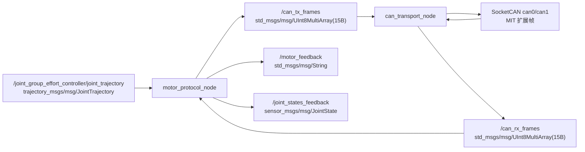
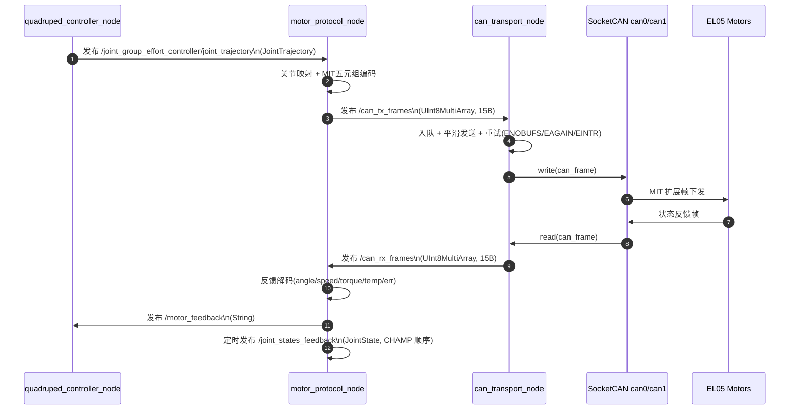

# trotbot_ws

协作向文档（需求 / 架构 / 问题 / 运行入口摘要）：[`docs/trotbot/README.md`](docs/trotbot/README.md)；包内逐步操作：[`src/trotbot/本地运行指南.md`](src/trotbot/本地运行指南.md)；CAN 桥与 `power_sequence` 细节：[`src/trotbot_can_bridge/README.md`](src/trotbot_can_bridge/README.md)。

## 重新编译（工作空间根目录执行）

先加载 ROS 2 环境（以 Humble 为例，按你本机发行版修改）：

```bash
source /opt/ros/humble/setup.bash
cd /home/cat/trotbot_ws
```

只编译 `trotbot` 功能包（改 URDF、launch、meshes 等后常用）：

```bash
colcon build --packages-select trotbot trotbot_can_bridge --symlink-install
```

编译整个工作空间：

```bash
colcon build --symlink-install
```

编译完成后加载覆盖层：

```bash
source install/setup.bash
```

## MIT 双 CAN：直接可复制步骤

### 1) 开机后先确认 CAN 接口

```bash
ip -br link
ip -details link show can0
ip -details link show can1
```

若看不到 `can0/can1`，先按下面的**稳定配置**修复（LubanCat-4-v1 已验证）：

```bash
sudo cp /boot/firmware/ubuntuEnv.txt /boot/firmware/ubuntuEnv.txt.bak.$(date +%Y%m%d-%H%M%S)

# 关键点1：主 DTB 保持 4-v1（保底，避免依赖手工生成的 display.dtb）
sudo sed -i 's#^fdtfile=.*#fdtfile=rk3588s-lubancat-4-v1.dtb#' /boot/firmware/ubuntuEnv.txt

# 关键点2：overlay_prefix 置空，避免把 rk3588-can overlay 错拼成 rk3588s 前缀
sudo sed -i 's#^overlay_prefix=.*#overlay_prefix=#' /boot/firmware/ubuntuEnv.txt

# 关键点3：使用运行时 overlays（显示 + CAN）
sudo sed -i 's#^overlays=.*#overlays=rk3588s-lubancat-dp0-in-vp1-overlay rk3588s-lubancat-4-hdmi0-overlay rk3588-lubancat-can0-m0-overlay rk3588-lubancat-can2-m0-overlay#' /boot/firmware/ubuntuEnv.txt

# 关键点4：重启前先确认 overlays 文件都存在
ls -1 /boot/firmware/dtbs/rockchip/overlay | rg -n '^(rk3588s-lubancat-dp0-in-vp1-overlay|rk3588s-lubancat-4-hdmi0-overlay|rk3588-lubancat-can0-m0-overlay|rk3588-lubancat-can2-m0-overlay)\\.dtbo$'

sudo reboot
```

> 说明：`rk3588s` 板子里使用 `rk3588-lubancat-can*.dtbo` 属于官方固件的常见命名，不是异常。

### 1a) 开机自动拉起 CAN（推荐）

当 `can0/can1` 已经由设备树创建出来时，用 systemd 保证每次开机自动 `up`：

```bash
sudo tee /etc/systemd/system/can-up.service >/dev/null <<'EOF'
[Unit]
Description=Bring up SocketCAN interfaces at boot
After=network-pre.target
Wants=network-pre.target

[Service]
Type=oneshot
ExecStart=/bin/bash -lc 'for i in can0 can1; do ip link show "$i" >/dev/null 2>&1 || continue; ip link set "$i" down || true; ip link set "$i" type can bitrate 1000000 restart-ms 100; ip link set "$i" up; ip link set "$i" txqueuelen 1000 || true; done'
RemainAfterExit=yes

[Install]
WantedBy=multi-user.target
EOF

sudo systemctl daemon-reload
sudo systemctl enable --now can-up.service
systemctl status can-up.service --no-pager
```

`txqueuelen 1000` 用于加大发送队列深度，减轻高频下发或并发发送时的 **`write: No buffer space available`**；负载不高时行为与默认相近。

### 1b) 复盘结论（为什么会“有时好有时坏”）

- **根因 1：overlay 命名匹配问题**  
  `overlay_prefix` 与 CAN dtbo 真实前缀不一致时，`can0/can1` 根本不会创建。
- **根因 2：显示 DTB/overlay 组合不稳**  
  启动日志出现 `vop2 ... No crtc register` / `display-subsystem ... bind failed` 时，显示链路失败，常伴随其它 overlays 生效异常（包括 CAN）。
- **关键认知：`can-up.service` 只能把“已存在”的接口置为 UP**  
  不能创建不存在的 `can0/can1`；接口创建必须先靠设备树成功。

### 2) 配置 1Mbps 并快速自测 CAN 互发

```bash
sudo ip link set can0 down || true
sudo ip link set can1 down || true
sudo ip link set can0 type can bitrate 1000000
sudo ip link set can1 type can bitrate 1000000
sudo ip link set can0 up
sudo ip link set can1 up
sudo ip link set can0 txqueuelen 1000
sudo ip link set can1 txqueuelen 1000
ip -details -statistics link show can0
ip -details -statistics link show can1
```

运行已有脚本（双向收发）：

```bash
bash src/trotbot/test/test_can
```

### 2a) 仅启动 CAN 桥节点（不测机器狗 / 不跑 CHAMP）

不启动 `trotbot_basic`（无 `quadruped_controller_node`、无状态估计），只拉起 **`can_transport_node` + `motor_protocol_node`**，用于单独验证 SocketCAN、话题桥接或对照 `candump`。

```bash
source /opt/ros/humble/setup.bash
cd /home/cat/trotbot_ws
colcon build --packages-select trotbot_can_bridge --symlink-install
source install/setup.bash
ros2 launch trotbot_can_bridge can_bridge.launch.py
```

接口名与默认配置不一致时（例如设备树里是 `can2` 映射成 `can1`），可覆盖：

```bash
ros2 launch trotbot_can_bridge can_bridge.launch.py can0_name:=can0 can1_name:=can1
```

使用自定义参数文件（例如打开十六进制行、调发送队列）：

```bash
ros2 launch trotbot_can_bridge can_bridge.launch.py \
  bridge_file:=/home/cat/trotbot_ws/src/trotbot_can_bridge/config/bridge.yaml \
  gains_file:=/home/cat/trotbot_ws/src/trotbot_can_bridge/config/control_gains.yaml
```

说明：

- **`motor_protocol_node`** 仍订阅 `/joint_group_effort_controller/joint_trajectory`。本启动里**没有** CHAMP 时，该话题默认无人发布，总线上不会有 MIT 下发；若要产生报文，需自行往该话题发一条 `JointTrajectory`，或改用下面「只跑传输层」。
- **只测 SocketCAN 收发**（不需要 MIT 编码）时，可只启动传输节点，并直接向 `/can_tx_frames` 发 15 字节打包帧（与 `FrameCodec` 约定一致），或在另一终端用 `candump` / `cansend` 对照。

```bash
source /opt/ros/humble/setup.bash
source /home/cat/trotbot_ws/install/setup.bash
ros2 run trotbot_can_bridge can_transport_node --ros-args \
  --params-file /home/cat/trotbot_ws/src/trotbot_can_bridge/config/bridge.yaml
```

### 2a-1) `power_sequence`：话题手动触发（无手柄 / 桌面调试）

当 `can_bridge.launch.py` 默认拉起 **`power_sequence_node`**（或整机 `use_can_bridge:=true`）时，除手柄组合键外，可直接向 **`/power_sequence/command`** 发 **`std_msgs/msg/String`**，用于上电流程、趴下、下电（与 `power_sequence_node` 内建指令一致，大小写不敏感）：

```bash
# 上电 / 启动流程（Idle 等允许状态下才会进入；否则节点会打 ignore 日志）
ros2 topic pub --once /power_sequence/command std_msgs/msg/String "{data: 'start'}"

# 趴下（在允许状态下触发）
ros2 topic pub --once /power_sequence/command std_msgs/msg/String "{data: 'prone'}"

# 下电流程
ros2 topic pub --once /power_sequence/command std_msgs/msg/String "{data: 'shutdown'}"

# 十二电机机械零位（仅 Idle + gate 关闭时生效；无手柄调试用）
ros2 topic pub --once /power_sequence/command std_msgs/msg/String "{data: 'set_zero'}"
```

执行前请 **`source install/setup.bash`**，且 **`power_sequence_node` 已在运行**。观察状态可配合：

```bash
ros2 topic echo /power_sequence/state --once
ros2 topic echo /power_sequence/gate_open --once
```

说明：若当前状态机不允许该指令，节点会忽略并输出 `ignore command=...`；未知字符串会提示 `supported: start/prone/shutdown/set_zero`。

**指令语义（与 `power_sequence_node` 一致）**

| 指令 | 作用概要 |
|------|----------|
| `start` | `Idle` → 上电站立流程；**`ProneHold`（已趴下且仍使能）** → 再次进入 `SoftStand` 站起 |
| `prone` | 仅在 **`Running`**：`SoftProne` 过渡到趴姿目标后进入 **`ProneHold`**，**不发 Reset、保持使能与 gate** |
| `shutdown` | **`ProneHold`**：直接进入 **`Disable`**（全机 `Reset` 后回 `Idle`）；其余 **`Idle` / `Precheck` / `EnableInit` / `SoftStand` / `Running` / `SoftProne`**：先 **`SoftProne`**，再 **`Disable`** |
| `set_zero` | **维修后机械零位**：仅 **`Idle`** 且 **`gate_open=false`** 时对 12 电机发 EL05 **`set_zero`**（CMD 0x06）；非 Idle 拒绝（日志 WARN）。与 URDF `joint_offsets` 标定不同层 |

手柄等效：`L1+R1`（且**未**按 Share）或 **`□`（Square）** 长按 → 与 **`start`** 相同计时（`start_longpress_s`）；**`○`（Circle）** 长按 → 与 **`prone`** 相同计时（`prone_longpress_s`）。PS4 类布局下 `□` 默认 `button_square:=3`，若与你的 `sensor_msgs/Joy` 不符请改 `power_sequence.yaml`。

**机械零位（RQ-024）**：仅在 **`Idle`、尚未 `start`** 时使用——PS4 **Options** 长按 **`set_zero_longpress_s`**（默认约 2 s，防误触），或上述话题 **`set_zero`**。按钮索引 **`button_option`**（默认 9）务必用 **`ros2 topic echo /joy`** 对照 Options 实测；设 **`button_option: -1`** 可关闭手柄、仅保留话题。勿与 **`el05_motor_explicit_cmds_12_direct.sh`** 等 **cansend** 脚本并发抢总线。

**站立 `Running` 时再触发 `start`（话题或 □/L1+R1）**：话题会 **`ignore`**；手柄在 **`Running`** 分支**只处理**下电与 **`prone`**，**不会**执行 start，也**不会**先趴再起。

**关于 `SoftProne` / `SoftStand` 的高度**：默认 **`track_body_pose_height:=true`** 时，进入 **`SoftProne`（含下电路径）** 会以**最近一次有效的 `body_pose.position.z`（与本节点发布同源话题）** 为起点插值到 `prone_z`，避免遥控压低高度后仍先抬回 `stand_z` 再趴。仅 **`prone` 路径**在趴下前会记录 **`stand_resume_z`**，随后 **`start` 站起** 时 `SoftStand` 插值到该高度而非固定 `stand_z`，减轻「站回名义高度再突然下落」的跳变。冷启动 **`Idle`→`start`** 仍用 `stand_z` 作为站起目标。跟踪超时（`body_pose_stale_s`）或无样本时回退到本节点**上次发布的 z**，再回退 `stand_z`。参数见 `power_sequence.yaml`。

**`ProneHold` 与 `start`（站起）**：`ProneHold` 持续发布 **`prone_z`**（相对 CHAMP 名义高度的 z 增量，**不是**机械结构上的「全局最低点」）。从 **`ProneHold` 发 `start`** 只会进入 **`SoftStand`**：在 **`stand_z`↔`prone_z`** 上从趴姿插值回站姿，**不会**先发失能、也不会再走一遍 `EnableInit` 的使能/MIT 零帧（电机已在运行态）。若在 **`SoftProne`（趴下动画）尚未结束**时发 `start`，实现上会 **挂起**：动画结束后直接进入 **`SoftStand`**，避免第一次 `start` 被忽略、需连发两次的现象。

**关于 `ros2 topic pub ... Waiting for at least 1 matching subscription(s)...`**：这是 **ROS 2 CLI 在等 DDS 发现订阅者**（`power_sequence_node` 未起来或 discovery 慢），与机体是否站立**无因果关系**；有/无这行日志都不应作为「站得好不好」的判断依据。

### 2b) `cansend`：电机主动上报（EL05 通信类型 24）

依赖 **`can-utils`**（若未安装：`sudo apt-get install -y can-utils`）。请先按上一节把对应接口配置为 **1Mbps** 并已 **`up`**。

手册「**通信类型 24：电机主动上报帧**」要点（与你提供的截图一致）：

- **扩展帧 29-bit CAN ID**：最高 5 位（bits 28–24）为 **`0x18`**；低字节（bits 7–0）为 **目标电机 CAN_ID**；中间字段含 **主 CAN_ID（bits 15–8）**，常见默认 **全 0**。
- **数据域 8 字节**：Byte0–Byte5 固定 **`01 02 03 04 05 06`**；Byte6 **`F_CMD`**：**`01`** 开启主动上报（说明书默认上报周期约 **10ms**），**`00`** 关闭；Byte7 填 **`00`**。

**电机 ID = 13（0x0D）、主 CAN_ID = 0** 时，扩展 ID 与手册示例一致为 **`0x1800000D`**。在同一终端可直接执行：

```bash
# 开启 ID13 主动上报（请把 can0 换成电机所在总线，如 can1）
cansend can0 1800000D#0102030405060100

# 关闭主动上报
cansend can0 1800000D#0102030405060000
```

### 2c) 12 电机「设置零位」显式命令（前腿 can0，后腿 can1）

> 设置零位命令：`CMD=0x06`，主站默认 `0xFD`，数据区使用 `0100000000000000`。  
> 报文格式：`cansend <iface> 0600FD<电机IDHEX>#0100000000000000`

```bash
# 前腿（can0）：11 12 13 21 22 23
cansend can0 0600FD0B#0100000000000000   # ID11
cansend can0 0600FD0C#0100000000000000   # ID12
cansend can0 0600FD0D#0100000000000000   # ID13
cansend can0 0600FD15#0100000000000000   # ID21
cansend can0 0600FD16#0100000000000000   # ID22
cansend can0 0600FD17#0100000000000000   # ID23

# 后腿（can1）：51 52 53 61 62 63
cansend can1 0600FD33#0100000000000000   # ID51
cansend can1 0600FD34#0100000000000000   # ID52
cansend can1 0600FD35#0100000000000000   # ID53
cansend can1 0600FD3D#0100000000000000   # ID61
cansend can1 0600FD3E#0100000000000000   # ID62
cansend can1 0600FD3F#0100000000000000   # ID63
```

另一终端观察总线（任选接口）：

```bash
candump -tz can0
```

若你的 **主 CAN_ID ≠ 0**，不要用固定 `1800000D`，改用下面一行拼装 ID（`MASTER`、电机号按实机填写）：

```bash
MASTER=0          # 主 CAN_ID（对应手册 bits 15–8），默认 0
MID=13            # 目标电机 CAN_ID（十进制）
EXT_ID=$(printf '%08X' $((0x18000000 | (MASTER << 8) | MID)))
cansend can0 ${EXT_ID}#0102030405060100
```

细节以仓库内 **`EL05使用说明书`** 为准；若与实机 ID 分层规则不一致，以最新版手册章节为准。

### 3) 启动 MIT-only 双节点桥接（当前主链路）

```bash
source /opt/ros/humble/setup.bash
cd /home/cat/trotbot_ws
colcon build --packages-select trotbot_can_bridge trotbot --symlink-install
source install/setup.bash
ros2 launch trotbot trotbot_basic.launch.py use_can_bridge:=true rviz:=true
```

默认已使用 **`minidog_champ.urdf.xacro`** 与 **`gait_minidog.yaml`**（与 `trotbot_basic.launch.py` / `champ_controllers.launch.py` 一致）。若需旧款 `trotbot.urdf.xacro` 整机，请显式传入：

`description_file:=trotbot.urdf.xacro gait_config_file:=gait.yaml`

推荐一条命令直接带起 `can_bridge + teleop`（便于单终端联调；URDF/步态已随上条默认，无需再写）：

```bash
ros2 launch trotbot trotbot_basic.launch.py \
  use_can_bridge:=true \
  use_teleop:=true \
  use_joystick:=true \
  use_xterm:=false \
  rviz:=false \
  use_status_led:=true
```

#### 开机自启（systemd）

将示例单元复制为系统服务并修改 **`User`**、**`/home/bot/trotbot_ws`** 为你的账户与工作空间路径：

```bash
source /opt/ros/humble/setup.bash && source ~/trotbot_ws/install/setup.bash
sudo cp "$(ros2 pkg prefix trotbot)/share/trotbot/config/systemd/trotbot-basic.service.example" /etc/systemd/system/trotbot-basic.service
sudo nano /etc/systemd/system/trotbot-basic.service   # 改 User、WorkingDirectory、ExecStart 中的路径
sudo systemctl daemon-reload
sudo systemctl enable --now trotbot-basic.service
journalctl -u trotbot-basic.service -f
```

**灯带与 sudo**：`use_status_led:=true` 时，`status_led` 默认 **`sudo -E`** 启动灯节点；systemd 无交互终端，若未配置 **NOPASSWD**，请在 **`ExecStart` 同一行末尾**追加 **`status_led_use_sudo:=false`**（适用 **spidev** + 用户已在 **dialout** 等组）。详见 `src/trotbot_status_led/README.md`。

**遥控**：无图形、无分配 TTY 时，键盘遥控无法像终端里一样使用；手柄需运行用户在 **`input`** 组。

### 4) 遥控：键盘 / PS4 手柄（可选）

本节对应 **单独再开一个终端** 拉的 `champ_teleop`（与 **`trotbot_basic` 整机栈**分开启动）。使用前请先 **`source install/setup.bash`**。

#### 4.1 键盘（默认：只读键盘，`joy_node` 不启动）

默认会在 **`xterm`** 里打开键盘遥控窗口（需本机有图形桌面与 `DISPLAY`）。只有键盘时：

```bash
ros2 launch trotbot trotbot_teleop.launch.py
```

无桌面 / SSH 无 X11 时，在同一 TTY 里跑键盘（**不用 xterm**）：

```bash
ros2 launch trotbot trotbot_teleop.launch.py use_xterm:=false
```

（需在**真实终端**里焦点在该窗口，否则读不到按键。）

#### 4.2 PS4 手柄（示例：`/dev/input/js0`）

1. **确认设备节点**（你已连接 PS4 且为 `js0` 时可跳过改名）：

   ```bash
   ls -l /dev/input/js0
   ```

2. **权限**：确保当前用户在 **`input`** 组（否则 `joy_node` 打不开设备）：

   ```bash
   groups | grep input || sudo usermod -aG input "$USER"
   ```

   改组后需 **重新登录** 或 **`newgrp input`** 后再试。

3. **先开整机栈**（另一终端，含 `quadruped_controller` 等），再开遥控：

   ```bash
   ros2 launch trotbot trotbot_teleop.launch.py use_joystick:=true joystick_dev:=/dev/input/js0
   ```

   `joystick_dev` 默认为 **`/dev/input/js0`**，与你的设备一致时可简写：

   ```bash
   ros2 launch trotbot trotbot_teleop.launch.py use_joystick:=true
   ```

4. **可选自检**：确认 `/joy` 有数据：

   ```bash
   ros2 topic echo /joy --once
   ```

#### 4.3 键盘和手柄是「二选一」吗？

**不是启动层面的二选一。** `use_joystick:=true` 时会同时：

- 启动 **`joy_node`**（读手柄，发布 **`/joy`**），以及  
- 启动 **`champ_teleop`**（键盘线程仍在「键盘所在终端 / xterm」里等待按键）。

二者都会向 **`cmd_vel`**、**`body_pose`** 等话题发指令（**谁后发谁覆盖**，没有 `twist_mux` 仲裁）。  
因此：**可以同时连着**，但若一手键盘一手柄同时推杆，运动会「抢话题」。常规用法是 **同一时间只用一种输入**，或只用键鼠停住再用手柄。

**若 `/joy` 有数据、RViz/真机却像不响应手柄**：旧版 `champ_teleop` 主线程一直卡在键盘读键、**没有 `spin`**，导致 **`joy_callback` 从不执行**；本工作空间内已改为 **后台 `SingleThreadedExecutor` 处理 `/joy`**。更新后请 **`colcon build --packages-select champ_teleop`** 并 **`source install/setup.bash`** 再启动。若仍无响应，再按下一节核对 PS4 轴/键编号是否与脚本一致。

#### 4.4 手柄映射说明（`champ_teleop` 源码约定）

以下为 `champ_teleop` 里 **`joy_callback`** 使用的 **轴/键索引**（偏 Xbox 类布局）。不同品牌（含 PS4）在 Linux 下 **`sensor_msgs/Joy` 里下标可能不一致**，若方向或功能不对，用 **`ros2 topic echo /joy`** 对照按键编号后再改 `src/champ_teleop/champ_teleop.py` 或做一层 remap。

| 作用 | 假定索引 |
|------|----------|
| 前后移动 `cmd_vel.linear.x` | `axes[1]` |
| 左右（平移/自旋取决于侧键） | `axes[0]`，与 `buttons[4]` 组合 |
| 体态 roll / pitch / yaw、`body_pose` | `axes[3]`、`axes[4]`，以及 `buttons[5]` 切换 roll 与 yaw |
| 机身高度微调 `body_pose.position.z`（推杆低于死区） | `axes[5] < 0` 时 `axes[5] * 0.5` |

键盘 **`t` / `b`** 与手柄 **「高度」通道**语义一致（见 `champ_teleop` 帮助文案），在同一 `champ_teleop` 进程内生效。

### 5) 观察链路（可选）

```bash
ros2 topic echo /can_tx_frames
ros2 topic echo /motor_feedback
```

## ROS2 架构与消息说明（MIT-only 双节点 CAN 桥接）

当前主链路采用两个节点解耦：

- `motor_protocol_node`：协议层，负责 `JointTrajectory -> MIT 五元组 CAN 帧` 编码，以及 RX 反馈解码
- `can_transport_node`：传输层，负责 `SocketCAN(can0/can1)` 的收发与 ROS 话题桥接

### 1) 总体 Mermaid 架构图



### 2) 端到端时序 Mermaid 图



### 3) 节点收发关系（按当前实现）

| 节点 | 订阅 Topic | 发布 Topic | 说明 |
|---|---|---|---|
| `motor_protocol_node` | `/joint_group_effort_controller/joint_trajectory` (`trajectory_msgs/msg/JointTrajectory`)、`/can_rx_frames` (`std_msgs/msg/UInt8MultiArray`) | `/can_tx_frames`、`/motor_feedback`、**`/joint_states_feedback`**（`sensor_msgs/msg/JointState`，定时 **`feedback_joint_states_timer_hz`** + CAN 缓存） | MIT 编码/解码；`enable_rx_decode_log` 仅影响字符串日志，不关闭反馈解析 |
| `can_transport_node` | `/can_tx_frames` (`std_msgs/msg/UInt8MultiArray`) | `/can_rx_frames` (`std_msgs/msg/UInt8MultiArray`) | 双通道 SocketCAN 收发（`can0/can1`），带发送队列、重试与 5 秒统计 |

### 4) Topic 消息类型与“实际消息”示例

#### 4.1 输入轨迹：`/joint_group_effort_controller/joint_trajectory`

消息类型：`trajectory_msgs/msg/JointTrajectory`  
作用：上游控制器给出 12 关节目标角，`motor_protocol_node` 取 `points[0].positions` 进行 MIT 下发。

示例（简化）：

```yaml
header:
  frame_id: ""
joint_names: [lf_hip_joint, lf_upper_leg_joint, lf_lower_leg_joint, rf_hip_joint, ...]
points:
  - positions: [0.10, -0.45, 0.90, -0.10, -0.45, 0.90, 0.10, -0.45, 0.90, -0.10, -0.45, 0.90]
    velocities: []
    accelerations: []
    effort: []
    time_from_start: {sec: 0, nanosec: 20000000}
```

#### 4.2 协议桥接帧：`/can_tx_frames` 与 `/can_rx_frames`

消息类型：`std_msgs/msg/UInt8MultiArray`  
当前固定长度：15 字节，编码定义如下：

- `[0]` `bus`：`0=can0, 1=can1`
- `[1]` `is_extended`：`0/1`
- `[2]` `dlc`
- `[3..6]` `can_id`（大端）
- `[7..14]` `data[8]`

示例（来自日志的一帧，`can1 id=0x17fff35 dlc=8 data=[117 75 127 255 15 92 76 204]`）：

```yaml
layout:
  dim: []
  data_offset: 0
data: [1, 1, 8, 0x01, 0x7f, 0xff, 0x35, 117, 75, 127, 255, 15, 92, 76, 204]
```

#### 4.3 反馈解析：`/motor_feedback`

消息类型：`std_msgs/msg/String`  
作用：`motor_protocol_node` 把 `/can_rx_frames` 解码后发布文本反馈，便于快速观测联调。

示例：

```text
bus=1 motor=53 mode=1 angle=0.123 speed=-0.045 torque=0.210 temp=36 err=0
```

#### 4.4 CHAMP 反馈关节态：`/joint_states_feedback`

消息类型：`sensor_msgs/msg/JointState`  
作用：将 EL05 反馈角反解到 CHAMP/URDF 关节名顺序，供 **`robot_state_publisher_feedback`**（TF 前缀 `fb/`）与 RViz **`RobotModelFeedback`**。  
发布节奏：参数 **`feedback_joint_states_timer_hz`**（默认约 50Hz）定时发布；数值在 CAN 反馈到达时更新缓存。  
与 **`enable_rx_decode_log`**：关闭后者仍会解码并更新反馈角，仅减少 `/motor_feedback` 与解码 INFO（见 `docs/trotbot/开发问题跟踪.md` ISSUE-0005）。

#### 4.5 单行十六进制可读输出：`/can_frames_tx_line`、`/can_frames_rx_line`（可选）

`/can_tx_frames` / `/can_rx_frames` 仍是 `UInt8MultiArray`（15 字节打包），`ros2 topic echo` 默认按十进制列出 `data`，可读性一般。

在 `can_transport_node` 中可开启 **`publish_hex_lines`**（默认关闭），按方向拆成两个 **`std_msgs/msg/String`** 话题，一行包含 **TX/RX、总线、标准/扩展、CAN ID、DLC、payload（十六进制）**，便于分开 `echo`：

```text
TX can1 EXT id=0x017FFF0D len=08 75 4B 7F FF 0F 5C 4C CC
RX can0 EXT id=0x027FFF0B len=08 ...
```

启用方式（编辑 `src/trotbot_can_bridge/config/bridge.yaml`）：

```yaml
publish_hex_lines: true
hex_tx_line_topic: /can_frames_tx_line
hex_rx_line_topic: /can_frames_rx_line
```

观察：

```bash
ros2 topic echo /can_frames_tx_line
ros2 topic echo /can_frames_rx_line
```

> 注意：开启后 Tx+Rx 合计可达数千行/秒，仅建议在短时抓包或降 `loop_rate` 时使用。

### 5) 运行时统计日志说明（can_transport_node）

每 5 秒输出一次发送统计：

```text
TX stats(5s): enq=7779 ok=7779 fail=68 retry_fail=68 retry_ok=24 drop_overflow=0 drop_non_retry=0 drop_retry_exceeded=0 queue=0 fail_rate=0.87% retry_frame_ok_rate=100.00%
CAN bus counts(5s): tx_can0=6000 tx_can1=6000 rx_can0=6000 rx_can1=6000 | two-wire ping-pong check (expect ~0): (tx_can0-rx_can1)=0 (tx_can1-rx_can0)=0
```

字段解释：

- `enq`：入队帧数
- `ok`：成功发送次数（写 SocketCAN 成功）
- `fail`：发送失败尝试次数（可重试+不可重试）
- `retry_fail`：可重试失败次数（如 `ENOBUFS/EAGAIN/EINTR`）
- `retry_ok`：经历过至少一次失败后最终发送成功的帧数
- `drop_overflow`：队列满导致丢弃数
- `drop_non_retry`：不可重试错误导致丢弃数
- `drop_retry_exceeded`：超过最大重试次数导致丢弃数
- `queue`：当前待发送队列长度
- `fail_rate`：失败尝试率，`fail / (ok + fail)`
- `retry_frame_ok_rate`：重试帧成功率，`retry_ok / 需要重试的帧数`

`CAN bus counts(5s)`：

- `tx_can0 / tx_can1`：过去 5 秒内各成功写入 SocketCAN 的下发帧数。
- `rx_can0 / rx_can1`：过去 5 秒内各控制器读到的接收帧数。
- `two-wire ping-pong check`：**(tx_can0 − rx_can1)** 与 **(tx_can1 − rx_can0)**。两片 CAN **点对点直连**（一侧发线进另一侧收）时，一般会看到一侧发出的帧在对侧收到，两项差值应接近 **0**。
- 若两片接口挂在**同一公共总线段**（多节点、两端终端电阻等），各路 RX 可能都能看到总线上几乎全部报文，`tx_*` 与“对侧 `rx_*`”未必一一配对，该项仅作定性参考。

说明：`retry_fail - retry_ok` 不能直接当作最终丢帧数，最终丢帧请看三个 `drop_*` 字段。

### 6) 频率关系、带宽估算与推荐值（1Mbps）

#### 6.1 先回答你的问题：是不是 1200Hz？

是的，按当前映射（每路 CAN 负责 6 个电机）：

- 轨迹频率设为 `F_traj`（Hz）
- 单路 CAN 下发帧率约为：`F_can_bus = 6 * F_traj`
- 双路合计下发帧率约为：`F_can_total = 12 * F_traj`

所以当 `F_traj = 200Hz` 时：

- 每路 CAN：`6 * 200 = 1200 帧/秒`
- 双路合计：`2400 帧/秒`

#### 6.2 1Mbps 下的粗略负载（MIT 8字节扩展帧）

按工程估算，一个扩展 CAN 数据帧（8B）上总线约 `130~160 bit/帧`（含仲裁/控制/CRC/ACK/EOF 与位填充近似）。

当 `200Hz` 时，单路下发负载约：

- `1200 帧/s * (130~160 bit) = 156~192 kbit/s`
- 占 `1M` 总线约 `15.6%~19.2%`

若电机反馈帧与下发同量级（近似 1:1），单路总负载约翻倍到：

- `31%~38%` 左右（仍有余量）

#### 6.3 推荐轨迹频率（1Mbps，当前双路各6电机）

- **推荐起步**：`100~200Hz`（调试稳定、错误率低）
- **常用建议**：`200Hz`（当前实测稳定，可作为默认）
- **可尝试上探**：`250~300Hz`（需重点观察 `fail_rate/drop_*`）
- **不建议长期**：`>300Hz`（突发排队、ENOBUFS 风险明显增大，需更严格限流与优先级设计）

实机以这几个指标判定是否该降频：

- `drop_overflow`、`drop_non_retry`、`drop_retry_exceeded` 是否持续非零
- `fail_rate` 是否持续升高
- `queue` 是否长期不回落

#### 6.4 各节点频率关系（当前实现）

| 环节 | 当前来源/默认 | 频率关系 |
|---|---|---|
| `quadruped_controller_node` 控制循环与轨迹发布 | `loop_rate`，默认 `200Hz`（CHAMP 源码默认） | 发布 `/joint_group_effort_controller/joint_trajectory` |
| `motor_protocol_node` | 被动订阅，无独立定时器 | 每收到 1 条轨迹，编码 12 帧到 `/can_tx_frames` |
| `can_transport_node` 发送出队 | `rx_poll_ms`（默认 `2ms`） + `max_tx_per_cycle`（默认 `8`） | 理论出队上限约 `500*8=4000 帧/s`（两路合并） |
| 单路 CAN 下发 | 由映射决定每路 6 电机 | `6 * F_traj` |

#### 6.5 如何修改频率

1) **改轨迹频率（推荐入口）**  
文件：`src/trotbot/config/champ/gait_minidog.yaml`  
参数（`ros__parameters` 顶层）：

```yaml
loop_rate: 200.0
```

例如改为 `150Hz`：

```yaml
loop_rate: 150.0
```

2) **必要时配合传输层节流**  
文件：`src/trotbot_can_bridge/config/bridge.yaml`

- `rx_poll_ms`：轮询周期（ms）
- `max_tx_per_cycle`：每轮最多发送帧数
- `tx_queue_max`：发送队列深度

#### 6.6 常用“看频率/看负载”命令

```bash
# 轨迹话题频率
ros2 topic hz /joint_group_effort_controller/joint_trajectory

# 桥接收发频率
ros2 topic hz /can_tx_frames
ros2 topic hz /can_rx_frames

# 单行十六进制（需先在 bridge.yaml 打开 publish_hex_lines）
ros2 topic echo /can_frames_tx_line
ros2 topic echo /can_frames_rx_line

# 查看单条消息内容（含 time_from_start 等）
ros2 topic echo /joint_group_effort_controller/joint_trajectory

# 看 CAN 控制器统计（错误/丢包/bus-off）
ip -details -statistics link show can0
ip -details -statistics link show can1
```

#### 6.7 轨迹频率 -> CAN 帧率小抄（当前 6 电机/路）

估算公式：

- 单路下发帧率：`F_can_bus = 6 * F_traj`
- 双路下发帧率：`F_can_total = 12 * F_traj`
- 单路下发负载估算：`F_can_bus * (130~160 bit/帧) / 1e6`

| 轨迹频率 `F_traj` | 单路下发帧率 | 双路下发帧率 | 单路下发负载估算（1Mbps） | 单路总负载估算（含近似1:1反馈） |
|---:|---:|---:|---:|---:|
| 100 Hz | 600 fps | 1200 fps | 7.8% ~ 9.6% | 15.6% ~ 19.2% |
| 150 Hz | 900 fps | 1800 fps | 11.7% ~ 14.4% | 23.4% ~ 28.8% |
| 200 Hz | 1200 fps | 2400 fps | 15.6% ~ 19.2% | 31.2% ~ 38.4% |
| 250 Hz | 1500 fps | 3000 fps | 19.5% ~ 24.0% | 39.0% ~ 48.0% |
| 300 Hz | 1800 fps | 3600 fps | 23.4% ~ 28.8% | 46.8% ~ 57.6% |

> 注：这是工程近似值（位填充、仲裁竞争、反馈策略会影响实测），最终以 `ip -details -statistics` 与 `TX stats(5s)` 为准。

使用前请在工作空间根目录执行 `source install/setup.bash`（或你本机 ROS 2 环境配置）。
