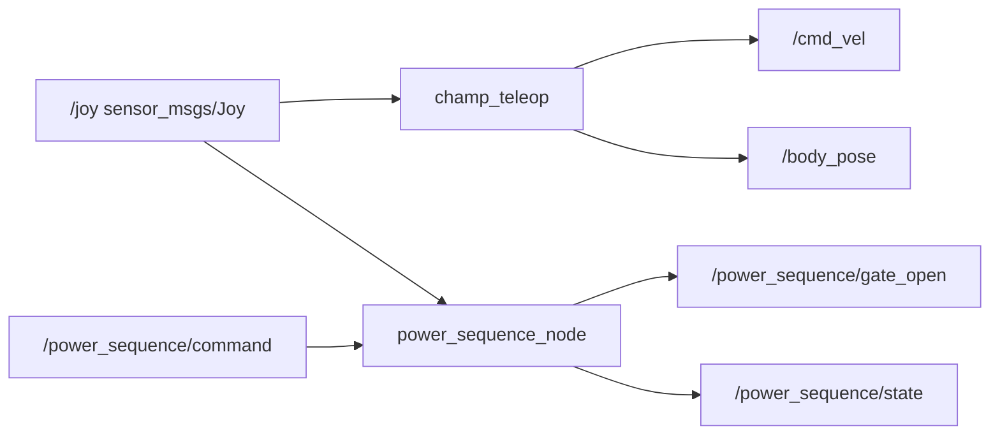

# PS4 手柄（DualShock 4）与 TrotBot 功能映射说明

本文档说明 PS4 手柄的**物理键位**、**`sensor_msgs/Joy` 中 `buttons` / `axes` 下标**（以本机实测为准），以及在本项目 **`champ_teleop`** 与 **`power_sequence_node`** 中分别实现的功能。操作一览与话题关系见下文表格及 Mermaid 图。

> **重要**：`joy` 的编号由 **Linux 输入子系统 + 驱动** 决定，**不同连接方式**（USB / 蓝牙）或 **不同驱动**（`hid-playstation` / 通用 HID）下，**`axes` 顺序可能与下图截图不完全一致**。**务必**在实机上执行 `ros2 topic echo /joy` 对照。  
> 下图为仓库内 **按键分布参考图**（同目录 `../image/PS4 按键分布.png`），用于快速对照「哪个键对应常见下标」；与代码不一致时**以 `echo` 为准**。

---

## 1. 参考图：按键与轴（与截图标注一致）

### 1.1 `buttons[]` 下标（红圈数字 0–12）

| 下标 | 物理键 | 本项目中典型用途（见 §3 / §4） |
|:----:|--------|----------------------------------|
| 0 | ✕（Cross） | `champ_teleop`：默认 **降低** 机体高度（`joy_height_dec_button`） |
| 1 | ○（Circle） | `power_sequence`：长按 **趴下** → `ProneHold`（`button_circle`） |
| 2 | △（Triangle） | `champ_teleop`：默认 **升高** 机体高度（`joy_height_inc_button`） |
| 3 | □（Square） | `power_sequence`：长按 **start**（等同上电流程，`button_square`） |
| 4 | L1 | `champ_teleop`：肩键模式切换；`power_sequence`：与 R1 组合 **start / shutdown** |
| 5 | R1 | 同上 |
| 6 | L2（部分驱动为**数字键**） | 依驱动可能为 0/1 或走 `axes` 模拟量 |
| 7 | R2（部分驱动为**数字键**） | 同上 |
| 8 | SHARE | `power_sequence`：与 L1+R1 同时按 → **下电** 组合（`button_share`） |
| 9 | OPTIONS | `power_sequence`：长按 **机械 set_zero**（`button_option`，RQ-024） |
| 10 | PS 键 | 本仓库流程**未绑**；部分系统会抢焦点 |
| 11 | L3（左摇杆按下） | 本仓库**未绑**（`champ_teleop` 未用） |
| 12 | R3（右摇杆按下） | 本仓库**未绑** |

### 1.2 `axes[]`（截图中的轴编号与极值）

截图对左右摇杆、L2/R2 模拟、十字键的标注如下（**若与你机 `echo` 不一致，以实测为准**）：

| 轴（截图标注） | 常见物理含义 | 极值方向（截图） |
|:--------------:|--------------|------------------|
| 左摇杆竖直 | 前后推杆 | 上 `1.0` / 下 `-1.0` |
| 左摇杆水平 | 左右推杆 | 左 `1.0` / 右 `-1.0` |
| L2 模拟 | 左扳机行程 | 松开约 `1.0`、压满约 `-1.0` |
| 右摇杆竖直 | 前后 | 上 `1.0` / 下 `-1.0` |
| 右摇杆水平 | 左右 | 左 `1.0` / 右 `-1.0` |
| R2 模拟 | 右扳机行程 | 同上 |
| 十字键水平 / 竖直 | D-Pad | 依驱动映射 |

**与本仓库 `champ_teleop.py` 的对应关系（代码事实）**：

- **`axes[1]`**：**前后线速度** `cmd_vel.linear.x`（× `speed`）。
- **`axes[0]`**：**左右**——未按 L1 时为 **转向** `angular.z`；按住 **L1（`buttons[4]`）** 时为 **横移** `linear.y`。
- **`axes[3]`、`axes[4]`**：与 **L1/R1 模式** 组合用于 **机体 roll/pitch/yaw**（`body_pose`）。
- **`axes[5]`**：若 `joy_height_axis5_scale≠0`，**仅当 `axes[5]<0`**（常见为扣 **R2**）时叠加 **`body_pose.position.z`**（连续「趴低」）；松开时多为正值，**不参与抬高**，避免误触抬高。

若你机 **左摇杆轴顺序** 与上表不同，只会影响「前后/左右是否对调」，请用 `echo /joy` 看 **推前** 时哪一轴变化，再考虑是否改 `champ_teleop` 里轴下标（属高级改法，一般先确认驱动/模式）。

---

## 2. 话题与数据流（总览）

- 同一进程内 **`champ_teleop` 与 `power_sequence_node` 都订阅 `/joy`**，**无仲裁**：两路同时根据最新 `Joy` 更新；请避免**同时**键盘与手柄抢同一话题（见根 `README` 说明）。

---

## 3. `champ_teleop` 使用的键与轴

配置参考：[`src/trotbot/config/champ_teleop_ps4_cuhzct2e.defaults.yaml`](../../src/trotbot/config/champ_teleop_ps4_cuhzct2e.defaults.yaml)，详细说明见 [`src/champ_teleop/docs/PS4_JOY_MAPPING_zh.md`](../../src/champ_teleop/docs/PS4_JOY_MAPPING_zh.md)。

| 来源 | 功能 | 行为摘要 |
|------|------|----------|
| `axes[1]` | 前后速度 | `cmd_vel.linear.x` |
| `axes[0]` + 不按 L1 | 左右转向 | `cmd_vel.angular.z` |
| `axes[0]` + 按住 L1 `buttons[4]` | 左右平移 | `cmd_vel.linear.y` |
| `axes[3/4]` + L1/R1 | 机体 roll/pitch/yaw | `body_pose` |
| `buttons[2]` / `buttons[0]`（默认可改） | 离散步进高度 | △ 升 / ✕ 降 `body_pose.position.z` |
| `axes[5] < 0`（默认可关） | 连续趴低 | R2 行程叠加 `body_pose.position.z` |

---

## 4. `power_sequence_node` 使用的键（`power_sequence.yaml`）

文件：[`src/trotbot_can_bridge/config/power_sequence.yaml`](../../src/trotbot_can_bridge/config/power_sequence.yaml)。**长按时间**由对应 `*_longpress_s` 参数给出。

| 物理键（PS4） | 参数名 | 默认下标 | 功能 |
|---------------|--------|:--------:|------|
| L1 + R1，且**未**按 Share | `button_l1` / `button_r1` / `button_share` | 4 / 5 / 8 | 长按 ≈ 话题 **`start`**（上电/站立流程） |
| □ | `button_square` | 3 | 长按 ≈ **`start`**（与上项二选一） |
| L1 + R1 + **Share** | 同上 | 4+5+8 | 长按 ≈ **`shutdown`**（下电） |
| ○ | `button_circle` | 1 | 长按 ≈ **`prone`**（趴下至 ProneHold） |
| **OPTIONS** | `button_option` | 9 | 长按 ≈ 十二电机 **机械 set_zero**（**仅 Idle 且门禁关**，RQ-024） |

等效**话题**（无手柄时）：`/power_sequence/command` 字符串 **`start` / `prone` / `shutdown` / `set_zero`**（大小写不敏感）。

---

## 5. 标定与排障建议

1. **首次接线**：`ros2 topic echo /joy`，逐个按下 **□○△✕、肩键、Share、Options**，记录 **`buttons[i]`** 是否为 1。  
2. **与默认不符**：只改 YAML / `ros2 param set`，不要改物理键帽。  
3. **`power_sequence` 与脚本并发**：执行 **`el05_motor_cansend.sh`** / **`el05_motor_explicit_cmds_12_direct.sh`** 时不要在手柄上触发 **start / set_zero**，避免抢 CAN。

---

## 6. 相关文档路径

| 文档 | 说明 |
|------|------|
| [`../image/PS4 按键分布.png`](../image/PS4%20按键分布.png) | 手柄示意图与红圈下标 |
| [`src/champ_teleop/docs/PS4_JOY_MAPPING_zh.md`](../../src/champ_teleop/docs/PS4_JOY_MAPPING_zh.md) | `champ_teleop` 详细映射与参数 |
| [`src/trotbot_can_bridge/config/power_sequence.yaml`](../../src/trotbot_can_bridge/config/power_sequence.yaml) | 启停与 Option **set_zero** 数值参数 |
| 根目录 [`README.md`](../../README.md) §2a-1 | `power_sequence` 话题语义表 |
