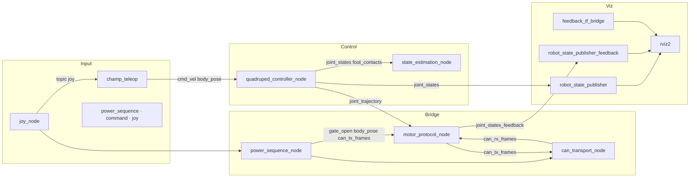

# ROS 2 节点与话题明细（运行快照）

本文档汇总 **某次实机/联调会话** 中 `ros2 node list` 与 `ros2 topic list` 的输出，并与仓库 launch、源码对照补全 **消息类型** 与 **数据流说明**。节点名、话题表会随启动参数（如 `rviz`、`use_can_bridge`、`publish_hex_lines`）变化；更新时请重新执行两条 list 命令并修订本节「快照信息」。

---

## 快照信息

| 项目 | 内容 |
|------|------|
| 采集方式 | `ros2 node list`、`ros2 topic list` |
| 说明 | 下文节点/话题集合与本快照一致；未出现在列表中的话题（如未启 RViz、未开 hex 行日志）属正常 |

---

## 1. 节点一览

以下节点与快照中 **完全同名** 的出现一致；包名与职责依据仓库 `launch` 与源码。

| 节点名 | 典型归属包 | 职责摘要 |
|--------|----------------|----------|
| `/can_transport_node` | `trotbot_can_bridge` | 订阅 `/can_tx_frames`，经 SocketCAN 下发；发布 `/can_rx_frames`；可选 `/can_frames_tx_line`、`/can_frames_rx_line`（十六进制行） |
| `/champ_teleop` | `champ_teleop` | 键盘/交互遥控：发布 `/cmd_vel`、`/body_pose`、`/body_pose/raw`；订阅 `/joy`、`/power_sequence/state` |
| `/feedback_tf_bridge` | `tf2_ros`（`static_transform_publisher`） | 发布 `base_link` → `fb/base_link` 静态 TF，对齐期望模型与反馈模型坐标系 |
| `/joy_node` | `joy` | 手柄驱动：发布 `/joy`，可与 `/joy/set_feedback` 交互 |
| `/motor_protocol_node` | `trotbot_can_bridge` | CHAMP 轨迹 ↔ EL05 CAN：订阅轨迹、`/can_rx_frames`、`/mit_gains_cmd`、`/power_sequence/gate_open` 等；发布 `/can_tx_frames`、`/joint_states_feedback`、`/motor_feedback` 等 |
| `/power_sequence_node` | `trotbot_can_bridge` | 上电/趴下/门禁：订阅 `/joy`、`/power_sequence/command`、`/body_pose`；发布 `/power_sequence/gate_open`、`/power_sequence/state`、`/can_tx_frames` 等 |
| `/quadruped_controller_node` | `champ_base` | CHAMP 步态：内部订阅经 launch 重映射为 `/cmd_vel`（见 `champ_controllers.launch.py`），订阅 `/body_pose`；发布 `/joint_group_effort_controller/joint_trajectory`、`/joint_states`、`/foot_contacts`（参数与仿真标志决定） |
| `/robot_state_publisher` | `robot_state_publisher` | 订阅 `/joint_states` 与 `/robot_description`，发布模型 TF |
| `/robot_state_publisher_feedback` | `robot_state_publisher` | 订阅 `/joint_states_feedback`、`/robot_description_feedback`，发布前缀 `fb/` 的反馈 TF |
| `/rviz2` | `rviz2` | 可视化；内部可出现 `/transform_listener_impl_*` 节点 |
| `/state_estimation_node` | `champ_base` | 订阅 `joint_states` + `foot_contacts` 同步；可选 `imu/data`；发布 `/odom/raw`、`/base_to_footprint_pose`、`/foot` |

**快照中的其它节点**

| 节点名 | 说明 |
|--------|------|
| `/transform_listener_impl_*` | RViz 内部 TF 监听实现，**非业务节点**，可忽略 |

---

## 2. 话题一览（快照）

### 2.1 业务与控制

| 话题 | 消息类型 | 方向（简述） |
|------|-----------|----------------|
| `/cmd_vel` | `geometry_msgs/msg/Twist` | `champ_teleop` / `power_sequence_node`（解析阶段） / 外部测试 → `quadruped_controller_node`（经 remap） |
| `/body_pose` | `geometry_msgs/msg/Pose` | `champ_teleop`、`power_sequence_node` → `quadruped_controller_node`；`power_sequence_node` 可订阅（跟踪高度） |
| `/body_pose/raw` | `champ_msgs/msg/Pose` | `champ_teleop` →（调试/下游按需） |
| `/joint_group_effort_controller/joint_trajectory` | `trajectory_msgs/msg/JointTrajectory` | `quadruped_controller_node` → `motor_protocol_node` |
| `/joint_states` | `sensor_msgs/msg/JointState` | `quadruped_controller_node` → `state_estimation_node`、`robot_state_publisher` |
| `/joint_states_feedback` | `sensor_msgs/msg/JointState` | `motor_protocol_node` → `robot_state_publisher_feedback`、RViz |
| `/foot_contacts` | `champ_msgs/msg/ContactsStamped` | `quadruped_controller_node` → `state_estimation_node` |
| `/mit_gains_cmd` | `std_msgs/msg/String` | 外部 / 参数默认话题 → `motor_protocol_node`（运行时 MIT 增益与总线偏置等） |
| `/mit_motor_position_rad` | `sensor_msgs/msg/JointState` | `motor_protocol_node` → 观测（MIT 域映射角） |

### 2.2 CAN 与电机反馈

| 话题 | 消息类型 | 方向（简述） |
|------|-----------|----------------|
| `/can_tx_frames` | `std_msgs/msg/UInt8MultiArray` | `motor_protocol_node`、`power_sequence_node` → `can_transport_node` |
| `/can_rx_frames` | `std_msgs/msg/UInt8MultiArray` | `can_transport_node` → `motor_protocol_node` |
| `/can_frames_tx_line` | `std_msgs/msg/String` | `can_transport_node` → 调试（需参数开启 hex 行） |
| `/can_frames_rx_line` | `std_msgs/msg/String` | `can_transport_node` → 调试 |
| `/motor_feedback` | `std_msgs/msg/String` | `motor_protocol_node` → 日志/观测 |

### 2.3 电源序列与手柄

| 话题 | 消息类型 | 方向（简述） |
|------|-----------|----------------|
| `/power_sequence/command` | `std_msgs/msg/String` | 外部 → `power_sequence_node`（如 `start` / `prone` / `shutdown` / `set_zero`） |
| `/power_sequence/gate_open` | `std_msgs/msg/Bool` | `power_sequence_node` → `motor_protocol_node`（门禁，默认需 true 才透传轨迹） |
| `/power_sequence/state` | `std_msgs/msg/String` | `power_sequence_node` → `champ_teleop`、观测 |
| `/joy` | `sensor_msgs/msg/Joy` | `joy_node` → `champ_teleop`、`power_sequence_node` |
| `/joy/set_feedback` | `sensor_msgs/msg/JoyFeedback` | 与手柄力反馈相关（驱动侧） |

### 2.4 状态估计与可视化

| 话题 | 消息类型 | 说明 |
|------|-----------|------|
| `/odom/raw` | `nav_msgs/msg/Odometry` | `state_estimation_node` 发布 |
| `/base_to_footprint_pose` | `geometry_msgs/msg/PoseWithCovarianceStamped` | `state_estimation_node` 发布 |
| `/foot` | `visualization_msgs/msg/MarkerArray` | 足端可视化 |
| `/robot_description` | `std_msgs/msg/String`（URDF） | 供期望侧 `robot_state_publisher` / RViz |
| `/robot_description_feedback` | `std_msgs/msg/String`（URDF） | 供反馈侧 `robot_state_publisher_feedback`（launch 中 remap） |

### 2.5 RViz / 交互（可选）

| 话题 | 消息类型 | 说明 |
|------|-----------|------|
| `/clicked_point` | `geometry_msgs/msg/PointStamped` | RViz 默认工具 |
| `/goal_pose` | `geometry_msgs/msg/PoseStamped` | RViz 导航目标（若使用） |
| `/initialpose` | `geometry_msgs/msg/PoseWithCovarianceStamped` | RViz 初始位姿 |

### 2.6 系统话题

| 话题 | 消息类型 | 说明 |
|------|-----------|------|
| `/tf`、`/tf_static` | `tf2_msgs/msg/TFMessage` | 全局 TF |
| `/parameter_events` | `rcl_interfaces/msg/ParameterEvent` | 参数变更事件 |
| `/rosout` | `rcl_interfaces/msg/Log` | 聚合日志 |

---

## 3. 数据流关系（Mermaid）

与 `docs/trotbot/架构说明.md` 当前链路一致，便于和本节快照对照。



> **Mermaid 注意**：节点标签内不要使用 `[/...]` 形式——在 Mermaid 中会被当成「梯形节点」语法从而报错；改用引号包裹文案（如上 `"joy_node"`）。

---

## 4. 校验命令（更新本文档时）

在目标运行环境下执行：

```bash
ros2 node list
ros2 topic list
ros2 topic info /joint_group_effort_controller/joint_trajectory
ros2 interface show trajectory_msgs/msg/JointTrajectory
```

若需 **Publisher/Subscriber 列表**，可对关键话题使用：

```bash
ros2 topic info -v /can_tx_frames
```

---

## 5. 消息类型参考（字段与用途）

下列为本快照话题中出现的消息类型。完整 IDL 以系统为准：`ros2 interface show <package>/msg/<MessageName>`。

### 5.1 坐标变换：`tf2_msgs/msg/TFMessage`

**用途**：在 ROS 2 中传输一串带时间戳的坐标变换，供 `tf2` 查询「从坐标系 A 到坐标系 B」的平移与旋转。`/tf` 一般为动态变换（随关节、里程计更新）；`/tf_static` 为不变换（如传感器外参），由 `static_transform_publisher` 等发布。

| 字段 | 类型 | 含义 |
|------|------|------|
| `transforms` | `geometry_msgs/TransformStamped[]` | 多条变换，每条描述「父坐标系 → 子坐标系」 |

单条 `TransformStamped` 含：

| 字段 | 含义 |
|------|------|
| `header.stamp` | 该变换生效时间 |
| `header.frame_id` | **父坐标系**名称 |
| `child_frame_id` | **子坐标系**名称 |
| `transform.translation` | 从父到子原点的平移 (x,y,z)，单位米 |
| `transform.rotation` | 从父到子的旋转四元数 (x,y,z,w) |

**在本项目中**：`robot_state_publisher` 根据 `/joint_states` 与 URDF 发布关节链 TF；`robot_state_publisher_feedback` 使用前缀 `fb/`，与 `feedback_tf_bridge` 发布的 `base_link`→`fb/base_link` 一起构成反馈模型 TF 树。

---

### 5.2 几何与运动学

| 消息 | 主要字段 | 在本快照中的典型用途 |
|------|-----------|----------------------|
| `geometry_msgs/msg/Twist` | `linear` {x,y,z}，`angular` {x,y,z}（线速度 m/s、角速度 rad/s） | `/cmd_vel` 速度指令 |
| `geometry_msgs/msg/Pose` | `position`，`orientation`（四元数） | `/body_pose` 机体目标位姿 |
| `geometry_msgs/msg/PoseStamped` | `header` + `pose` | RViz `goal_pose` |
| `geometry_msgs/msg/PoseWithCovarianceStamped` | `header` + 带 6×6 协方差的位姿 | `/base_to_footprint_pose`、`initialpose` |
| `geometry_msgs/msg/PointStamped` | `header` + `point` {x,y,z} | RViz `clicked_point` |
| `nav_msgs/msg/Odometry` | `header`，`child_frame_id`，`pose`（位姿+协方差），`twist`（速度+协方差） | `/odom/raw` 里程计估计 |

---

### 5.3 关节与轨迹

| 消息 | 主要字段 | 在本快照中的典型用途 |
|------|-----------|----------------------|
| `trajectory_msgs/msg/JointTrajectory` | `header`，`joint_names[]`，`points[]`（每点含 `positions`/`velocities`/`effort`、`time_from_start`） | CHAMP → `motor_protocol` 的关节目标轨迹 |
| `sensor_msgs/msg/JointState` | `header`，`name[]`，`position[]`，`velocity[]`，`effort[]`（数组同长或留空） | `/joint_states`、`/joint_states_feedback`、`/mit_motor_position_rad`；反馈链路上 velocity/effort 是否填充见桥配置 |
| `champ_msgs/msg/ContactsStamped` | `header`，`contacts[]`（四足接触布尔） | `/foot_contacts` → 状态估计同步 |

---

### 5.4 手柄与电源序列

| 消息 | 主要字段 | 在本快照中的典型用途 |
|------|-----------|----------------------|
| `sensor_msgs/msg/Joy` | `header`，`axes[]`，`buttons[]` | `/joy` 手柄状态 |
| `sensor_msgs/msg/JoyFeedback` | `type`（LED/RUMBLE/BUZZER），`id`，`intensity` | `/joy/set_feedback` 力反馈（若硬件支持） |
| `std_msgs/msg/String` | `data` | 文本：`/motor_feedback`、`/power_sequence/command`、`/power_sequence/state`、`/mit_gains_cmd`（键值约定见 CAN 桥 README） |
| `std_msgs/msg/Bool` | `data` | `/power_sequence/gate_open` 门禁 |

---

### 5.5 CAN 与通用数组

| 消息 | 主要字段 | 在本快照中的典型用途 |
|------|-----------|----------------------|
| `std_msgs/msg/UInt8MultiArray` | `layout`（多维布局描述），`data[]`（原始字节） | `/can_tx_frames`、`/can_rx_frames`：**字节布局为项目自定义编码**（非通用 MultiArray 数学含义），需对照 `trotbot_can_bridge` 协议说明 |
| `std_msgs/msg/String`（hex 行） | `data` | `/can_frames_tx_line`、`/can_frames_rx_line`：可选 ASCII 十六进制行，便于示波与日志 |

---

### 5.6 可视化与模型

| 消息 | 主要字段 | 在本快照中的典型用途 |
|------|-----------|----------------------|
| `visualization_msgs/msg/MarkerArray` | `markers[]`（每条 Marker 含类型、位姿、尺度、颜色、生命周期等） | `/foot` 足端/调试可视化 |
| `std_msgs/msg/String`（URDF） | `data` 为 **URDF/XML 字符串** | `/robot_description`、`/robot_description_feedback`：供 `robot_state_publisher` 解析 |

---

### 5.7 CHAMP 轻量位姿

| 消息 | 主要字段 | 说明 |
|------|-----------|------|
| `champ_msgs/msg/Pose` | `x,y,z, roll, pitch, yaw`（float32） | `/body_pose/raw`：欧拉角形式的轻量体态（与 `geometry_msgs/Pose` 四元数版并存） |

---

### 5.8 系统与可选诊断

| 消息 | 主要字段 | 在本快照中的典型用途 |
|------|-----------|----------------------|
| `rcl_interfaces/msg/ParameterEvent` | `stamp`，`node`，`new_parameters` / `changed_parameters` / `deleted_parameters` | `/parameter_events` |
| `rcl_interfaces/msg/Log` | `stamp`，`level`，`name`，`msg`，`file`，`function`，`line` | `/rosout` 聚合日志 |
| `diagnostic_msgs/msg/DiagnosticArray` | `header`，`status[]`（`level`，`name`，`message`，`hardware_id`，`values[]`） | 可选：`motor_protocol` 在开启 `publish_motor_diagnostics` 时发布（默认话题见参数 `motor_diagnostics_topic`） |

---

### 5.9 从命令复查定义

```bash
ros2 interface show tf2_msgs/msg/TFMessage
ros2 interface show sensor_msgs/msg/JointState
# …对其余类型替换包名与消息名
```

---

## 6. 参考

- 架构与术语：`docs/trotbot/架构说明.md`
- CAN 桥参数与话题默认值：`src/trotbot_can_bridge/README.md`、`src/trotbot_can_bridge/config/control_gains.yaml`
- 启动编排：`src/trotbot/launch/trotbot_basic.launch.py`、`src/trotbot/launch/champ_controllers.launch.py`
