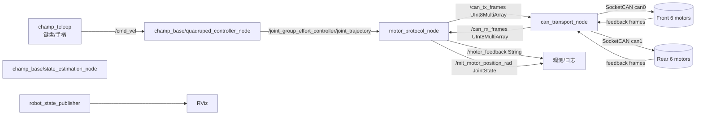
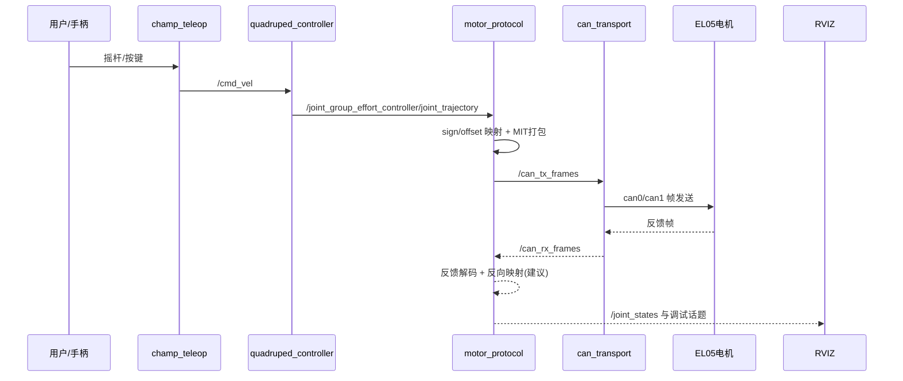
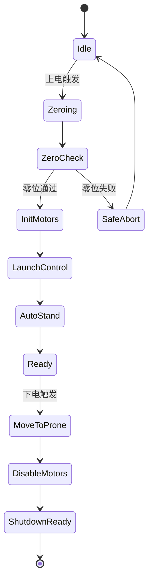
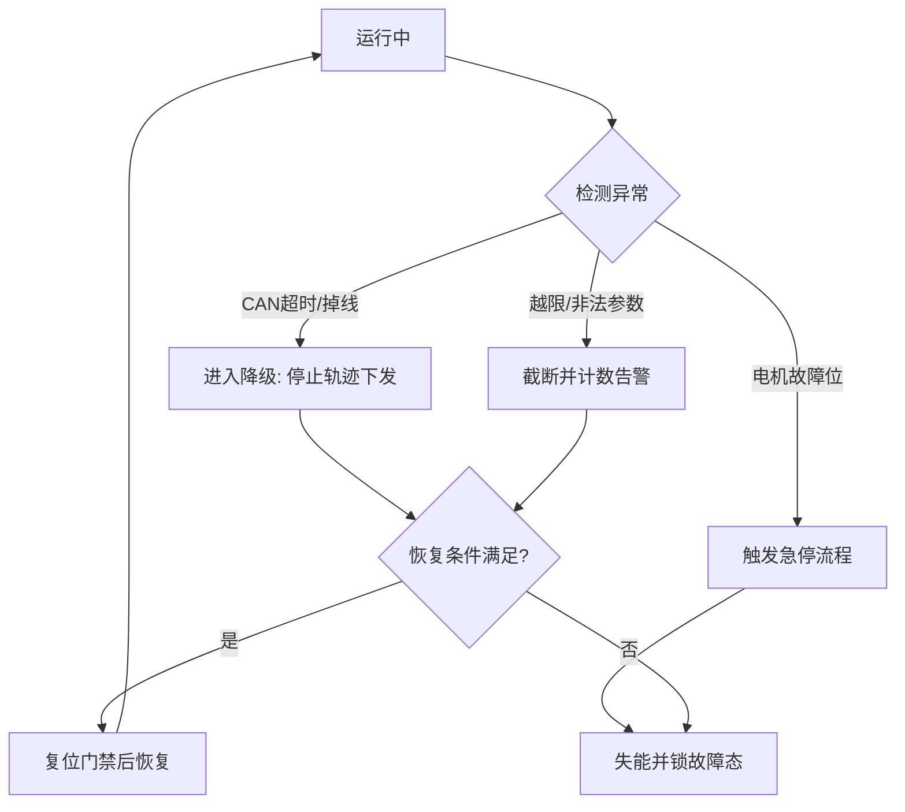

# TrotBot 架构说明（ROS 2 Humble + EL05 双 CAN）

本文档面向当前硬件与代码基线，给出可落地的软件架构、ROS 节点、话题分布与数据流向。

- 计算平台：鲁班猫4-V1（RK3588S）
- 系统：ROS 2 Humble
- 执行器：灵足 EL05 无刷关节电机（12 路）
- 总线拓扑：`can0` 前腿 6 电机（11/12/13/21/22/23），`can1` 后腿 6 电机（51/52/53/61/62/63）
- 通信基线：CAN 2.0，`1Mbps`

---

## 1. 设计目标与边界

### 1.1 版本目标（当前阶段）

1. 打通 CHAMP 轨迹到 12 电机的稳定执行链路。
2. 建立可观测闭环（至少覆盖原始反馈和映射后状态）。
3. 对总线、越限、失联等问题具备基础保护能力。
4. 保持架构可演进，支持后续一键上/下电流程与双模型可视化。

### 1.2 边界约束

- 步态控制核心继续复用 `champ_base`，不改 CHAMP 内核。
- 下位机协议遵循 EL05 文档，控制模式以 MIT 运控链路为主。
- 现阶段优先“功能可用与稳定”，控制频率后续按实测再收敛。

---

## 2. 当前代码基线架构（As-Is）

当前真实链路（已与代码对齐）如下：



### 2.1 已落地节点

- `champ_base/quadruped_controller_node`
  - 订阅 `cmd_vel`，发布关节轨迹到 `joint_group_effort_controller/joint_trajectory`。
- `champ_base/state_estimation_node`
  - 状态估计节点，提供 CHAMP 状态闭环所需估计量。
- `trotbot_can_bridge/motor_protocol_node`
  - 订阅 `joint_trajectory`，按关节映射生成 MIT 五元组并发布到 `can_tx_frames`。
  - 订阅 `can_rx_frames`，解析反馈并发布 `/motor_feedback`。
  - 可发布 MIT 映射角到 `/mit_motor_position_rad`。
- `trotbot_can_bridge/can_transport_node`
  - 订阅 `/can_tx_frames`，通过 SocketCAN 下发 `can0/can1`。
  - 轮询 `can0/can1` 回包并发布 `/can_rx_frames`。
  - 内置队列、重试、统计日志。

### 2.2 当前主要话题

| 话题 | 类型 | 方向 | 说明 |
|---|---|---|---|
| `/cmd_vel` | `geometry_msgs/Twist` | teleop -> CHAMP | 速度输入 |
| `/joint_group_effort_controller/joint_trajectory` | `trajectory_msgs/JointTrajectory` | CHAMP -> bridge | 12关节目标 |
| `/can_tx_frames` | `std_msgs/UInt8MultiArray` | protocol -> transport | 编码后的 CAN 帧 |
| `/can_rx_frames` | `std_msgs/UInt8MultiArray` | transport -> protocol | 回读 CAN 帧 |
| `/motor_feedback` | `std_msgs/String` | protocol -> debug | 解析后的电机反馈摘要 |
| `/mit_motor_position_rad` | `sensor_msgs/JointState` | protocol -> debug | 映射后的 MIT 位置 |

> 注：当前闭环观测更偏调试，尚未将反馈统一发布到标准 `/joint_states`。

---

## 3. 推荐目标架构（To-Be，V1.1）

目标是在不打断现有链路前提下，补齐“标准状态闭环 + 安全流程编排”。

```mermaid
flowchart LR
  subgraph Input["输入层"]
    joy[手柄/键盘]
    teleop2[champ_teleop]
  end
  subgraph Ctrl["控制层"]
    qc2[quadruped_controller_node]
    se2[state_estimation_node]
  end
  subgraph Bridge["执行桥接层"]
    mp2[motor_protocol_node]
    ct2[can_transport_node]
    sm[safety_manager_node<br/>建议新增]
    ps[power_sequence_node<br/>建议新增]
  end
  subgraph HW["硬件层"]
    can0b[(can0 front)]
    can1b[(can1 rear)]
    mtrs[(12x EL05)]
  end
  subgraph Viz["可视化与观测"]
    js[/joint_states feedback]
    cjs[/cmd_joint_states command]
    rviz2[RViz 单狗/双狗]
    diag[/diagnostics]
  end

  joy --> teleop2 -->|/cmd_vel| qc2
  qc2 -->|/joint_group_effort_controller/joint_trajectory| mp2
  mp2 -->|/can_tx_frames| ct2
  ct2 --> can0b --> mtrs
  ct2 --> can1b --> mtrs
  mtrs --> can0b --> ct2
  mtrs --> can1b --> ct2
  ct2 -->|/can_rx_frames| mp2

  mp2 --> js
  mp2 --> cjs
  mp2 --> diag
  ct2 --> diag
  sm -->|急停/限幅/门禁| mp2
  ps -->|上电下电状态机| sm
  js --> rviz2
  cjs --> rviz2
```

### 3.1 新增/增强建议

1. `motor_protocol_node` 增强反馈反解并发布 `/joint_states`
   - 反解公式：`urdf_pos = (motor_pos - offset) / sign`
   - 与 `DogMapper::kChampJointNames` 顺序严格一致。
2. 增加 `cmd_joint_states`（命令态）用于双模型可视化。
3. 增加 `safety_manager_node`（可先内聚在 `motor_protocol_node`，后续再拆分）
   - 负责急停、越限截断、超时门禁、恢复条件。
4. 增加 `power_sequence_node`
   - 将 set_zero、enable、auto-stand、prone、disable 编排成状态机。

---

## 4. 数据流与时序

### 4.1 控制主链路时序



### 4.2 上/下电流程状态机（建议）



---

## 5. 话题与接口规划（建议基线）

### 5.1 运动与状态接口

- 输入
  - `/cmd_vel`
  - `/joint_group_effort_controller/joint_trajectory`
- 执行桥接内部
  - `/can_tx_frames`
  - `/can_rx_frames`
- 输出（建议强制标准化）
  - `/joint_states`（实时反馈，URDF语义）
  - `/cmd_joint_states`（命令态，便于双模型）
  - `/motor_feedback`（保留调试文本）
  - `/diagnostics`（总线/协议/保护状态）

### 5.2 参数分层建议

- `control_gains.yaml`
  - `kp` `kd` `default_velocity` `default_tau_ff`
- `calibration_profiles.yaml`
  - `joint_signs[12]` `joint_offsets_rad[12]` `joint_limits_*`
- `motor_map.yaml`
  - `joint -> motor_id -> can_bus`
- `bridge.yaml`
  - `rx_poll_ms` `tx_queue_max` `max_retry_per_frame`

---

## 6. 故障处理流向（建议）



---

## 7. 与硬件平台匹配建议（RK3588S）

1. 进程部署
   - `can_transport_node` 与 `motor_protocol_node` 常驻，建议 systemd 级守护。
2. 资源隔离
   - 控制节点与可视化节点分组运行，避免 RViz 抢占实时链路。
3. 总线诊断
   - 保留 `can_transport_node` 5s 统计日志，作为现场首要健康指标。
4. 调参顺序
   - 先保守 `kp/kd` 与低速动作，再逐步提高动态性能。

---

## 8. 当前版本建议优先级（从功能性出发）

### P0（立即）

1. 完成 `/joint_states` 标准反馈发布（反向映射）。
2. 在 launch 中明确“真机仅 CAN bridge，禁用旧舵机链路”。
3. 增加最小安全门禁：反馈超时停止下发。

### P1（短期）

1. 上/下电流程状态机节点化（可先脚本后节点）。
2. 双模型 RViz（`cmd_joint_states` + `/joint_states`）。
3. 统一故障码与 `/diagnostics` 输出。

### P2（中期）

1. 安全管理独立成 `safety_manager_node`。
2. 形成自动化验收脚本（链路、方向、零位、故障注入）。

---

## 9. 架构相关关键文件索引

- 启动编排：`src/trotbot/launch/trotbot_basic.launch.py`
- CHAMP 控制：`src/trotbot/launch/champ_controllers.launch.py`
- CAN bridge 启动：`src/trotbot_can_bridge/launch/can_bridge.launch.py`
- 协议节点：`src/trotbot_can_bridge/src/motor_protocol_node.cpp`
- 传输节点：`src/trotbot_can_bridge/src/can_transport_node.cpp`
- 关节映射：`src/trotbot_can_bridge/include/trotbot_can_bridge/dog_mapper.hpp`
- 增益参数：`src/trotbot_can_bridge/config/control_gains.yaml`
- 总线映射：`src/trotbot_can_bridge/config/motor_map.yaml`

---

## 10. 备注

1. 本文档优先描述“可落地架构与演进路径”，目录级说明已弱化。
2. 如果你确认，我下一步可以直接补一版“节点接口契约表（消息字段级）”和“上/下电流程接口定义（service/action）”到本文件，便于直接进入开发。

