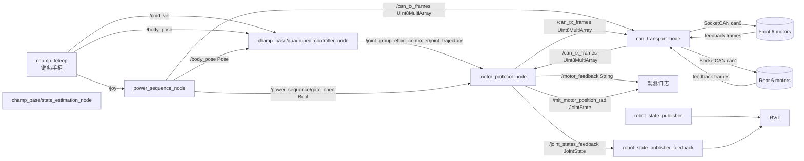
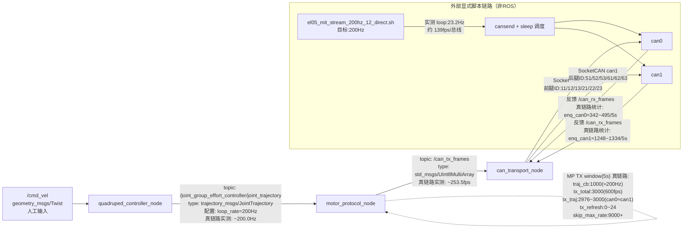
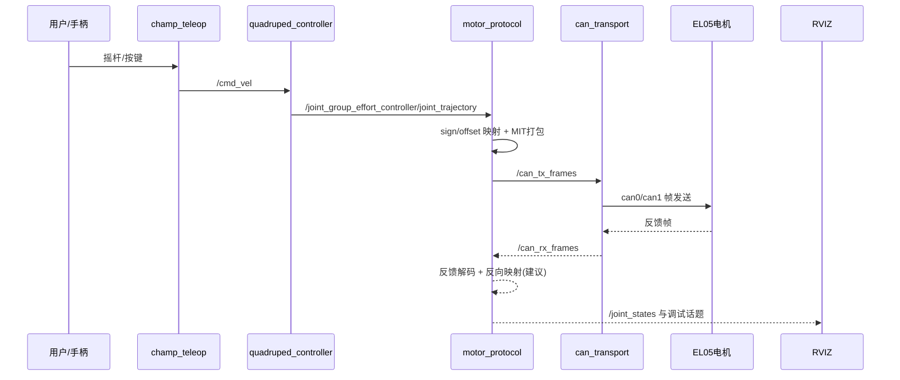
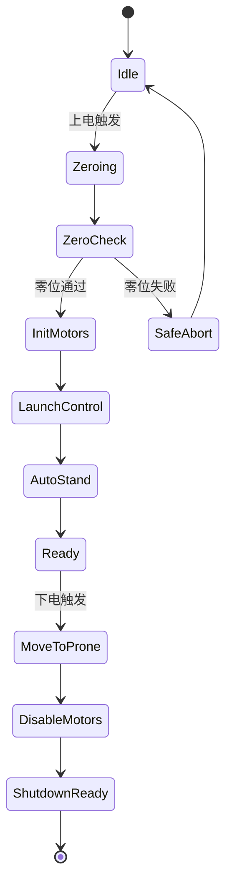
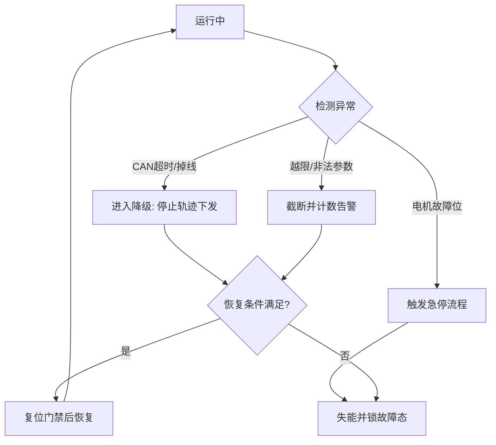

# TrotBot 架构说明（ROS 2 Humble + EL05 双 CAN）

本文档面向当前硬件与代码基线，给出可落地的软件架构、ROS 节点、话题分布与数据流向。

- 计算平台：鲁班猫4-V1（RK3588S）
- 系统：ROS 2 Humble
- 执行器：灵足 EL05 无刷关节电机（12 路）
- 总线拓扑：`can0` 前腿 6 电机（11/12/13/21/22/23），`can1` 后腿 6 电机（51/52/53/61/62/63）
- 通信基线：CAN 2.0，`1Mbps`

---

## 1. 设计目标与边界

### 1.1 版本目标（当前阶段）

1. 打通 CHAMP 轨迹到 12 电机的稳定执行链路。
2. 建立可观测闭环（至少覆盖原始反馈和映射后状态）。
3. 对总线、越限、失联等问题具备基础保护能力。
4. 保持架构可演进，支持后续一键上/下电流程与双模型可视化。

### 1.2 边界约束

- 步态控制核心继续复用 `champ_base`，不改 CHAMP 内核。
- 下位机协议遵循 EL05 文档，控制模式以 MIT 运控链路为主。
- 现阶段优先“功能可用与稳定”，控制频率后续按实测再收敛。

---

## 2. 当前代码基线架构（As-Is）

当前真实链路（已与代码对齐）如下：



### 2.1 已落地节点

- `champ_base/quadruped_controller_node`
  - 订阅 `cmd_vel`，发布关节轨迹到 `joint_group_effort_controller/joint_trajectory`。
- `champ_base/state_estimation_node`
  - 状态估计节点，提供 CHAMP 状态闭环所需估计量。
- `trotbot_can_bridge/motor_protocol_node`
  - 订阅 `joint_trajectory`，按关节映射生成 MIT 五元组并发布到 `can_tx_frames`。
  - 订阅 `can_rx_frames`，解析反馈；`enable_rx_decode_log` **仅**控制 `/motor_feedback` 字符串与解码 INFO，**不**影响反馈解析与关节角缓存。
  - 发布 `/joint_states_feedback`（CHAMP 关节名顺序，`SensorDataQoS`）；默认 **`feedback_joint_states_timer_hz`** 定时发布，与 CAN 反馈解耦，供 `robot_state_publisher_feedback` 与 RViz **`RobotModelFeedback`** 使用。
  - 可发布 MIT 映射角到 `/mit_motor_position_rad`。
  - 可选 `enable_power_sequence_gate`：仅当 `/power_sequence/gate_open=true` 时透传轨迹（与 `power_sequence_node` 联调）。
- `trotbot_can_bridge/can_transport_node`
  - 订阅 `/can_tx_frames`，通过 SocketCAN 下发 `can0/can1`。
  - 轮询 `can0/can1` 回包并发布 `/can_rx_frames`。
  - 内置队列、重试、统计日志。
- `trotbot_can_bridge/power_sequence_node`
  - 订阅 `/joy`、`/power_sequence/command`、`/body_pose`（可选跟踪当前高度指令），处理上电/下电/趴下与 **`start`/`prone`/`shutdown`** 话题。
  - 发布 `/power_sequence/gate_open`、`/power_sequence/state`。
  - 状态含 **`Idle / Precheck / EnableInit / SoftStand / Running / SoftProne / ProneHold / Disable / Fault`**：`prone` 与 **`○` 长按** → `SoftProne` → **`ProneHold`**（保持使能）；`shutdown` 与 **`L1+R1+Share`** → `SoftProne` → **`Disable`**（全机 Reset）；**`L1+R1` 或 `□` 长按** 与话题 **`start`** 等价（`start_longpress_s`）。
  - `SoftProne`/`SoftStand` 高度：默认 **`track_body_pose_height`** 用当前 `body_pose.z` 作趴下起点；**`prone` 路径**记录 **`stand_resume_z`** 供再次站起，减轻遥控调低高度后的阶跃。
  - 直接发布使能/失能/MIT 首帧到 `/can_tx_frames` 完成启停编排。

### 2.2 当前主要话题

| 话题 | 类型 | 方向 | 说明 |
|---|---|---|---|
| `/cmd_vel` | `geometry_msgs/Twist` | teleop -> CHAMP | 速度输入 |
| `/joint_group_effort_controller/joint_trajectory` | `trajectory_msgs/JointTrajectory` | CHAMP -> bridge | 12关节目标 |
| `/power_sequence/gate_open` | `std_msgs/Bool` | power_sequence -> protocol | 启动门禁开关（true 才透传轨迹） |
| `/power_sequence/command` | `std_msgs/String` | 外部 -> power_sequence | 无手柄时 `start`/`prone`/`shutdown` 文本指令 |
| `/power_sequence/state` | `std_msgs/String` | power_sequence -> 观测 | 状态机字符串（如 `Running`、`ProneHold`） |
| `/body_pose` | `geometry_msgs/Pose` | teleop / power_sequence -> quadruped_controller | 体态指令（`position.z` 为相对名义高度增量）；`power_sequence` 亦订阅以跟踪高度 |
| `/can_tx_frames` | `std_msgs/UInt8MultiArray` | protocol -> transport | 编码后的 CAN 帧 |
| `/can_rx_frames` | `std_msgs/UInt8MultiArray` | transport -> protocol | 回读 CAN 帧 |
| `/motor_feedback` | `std_msgs/String` | protocol -> debug | 解析后的电机反馈摘要（受 `enable_rx_decode_log` 控制是否刷屏） |
| `/mit_motor_position_rad` | `sensor_msgs/JointState` | protocol -> debug | 映射后的 MIT 位置 |
| `/joint_states_feedback` | `sensor_msgs/JointState` | protocol -> RSP/RViz | CHAMP 语义反馈角；供 **`robot_state_publisher_feedback`**（`fb/` TF 前缀）与 RViz 反馈模型 |

> 注：CHAMP 控制器仍发布 **`/joint_states`**（指令/估计链）；**反馈实测链**使用 **`/joint_states_feedback`**，与双模型 RViz 配置对应。

---

## 3. 推荐目标架构（To-Be，V1.1）

目标是在不打断现有链路前提下，补齐“标准状态闭环 + 安全流程编排”。

```mermaid
flowchart LR
  subgraph Input["输入层"]
    joy[手柄/键盘]
    teleop2[champ_teleop]
  end
  subgraph Ctrl["控制层"]
    qc2[quadruped_controller_node]
    se2[state_estimation_node]
  end
  subgraph Bridge["执行桥接层"]
    mp2[motor_protocol_node]
    ct2[can_transport_node]
    sm[safety_manager_node<br/>建议新增]
    ps2[power_sequence_node<br/>已落地]
  end
  subgraph HW["硬件层"]
    can0b[(can0 front)]
    can1b[(can1 rear)]
    mtrs[(12x EL05)]
  end
  subgraph Viz["可视化与观测"]
    js[/joint_states feedback]
    cjs[/cmd_joint_states command]
    rviz2[RViz 单狗/双狗]
    diag[/diagnostics]
  end

  joy --> teleop2 -->|/cmd_vel| qc2
  qc2 -->|/joint_group_effort_controller/joint_trajectory| mp2
  mp2 -->|/can_tx_frames| ct2
  ct2 --> can0b --> mtrs
  ct2 --> can1b --> mtrs
  mtrs --> can0b --> ct2
  mtrs --> can1b --> ct2
  ct2 -->|/can_rx_frames| mp2

  mp2 --> js
  mp2 --> cjs
  mp2 --> diag
  ct2 --> diag
  sm -->|急停/限幅/门禁| mp2
  ps2 -->|gate_open / body_pose| mp2
  js --> rviz2
  cjs --> rviz2
```

### 3.1 新增/增强建议

1. ~~`motor_protocol_node` 增强反馈反解并发布标准 JointState~~：**已实现** `/joint_states_feedback`（反解 `urdf_pos = (motor_pos - offset) / sign`，顺序同 `kChampJointNames`；可选与标准 `/joint_states` 命名合并属产品口径问题）。
2. 增加 `cmd_joint_states`（命令态）用于双模型可视化（当前 RViz 指令侧仍主要依赖 `/joint_states`）。
3. 增加 `safety_manager_node`（可先内聚在 `motor_protocol_node`，后续再拆分）
   - 负责急停、越限截断、超时门禁、恢复条件。
4. ~~增加 `power_sequence_node`~~（**已落地**：`trotbot_can_bridge/power_sequence_node.cpp`，参数 `power_sequence.yaml`）
   - 后续可增强：与 `safety_manager` 统一急停接口、Action/Service 封装。

---

## 4. 数据流与时序

### 4.0 频率分解总览（2026-04-29 实测）

> 目的：定位“期望 200Hz 为何在链路中下降”。



- 关键结论1：真链路下 `/joint_group_effort_controller/joint_trajectory` 已稳定在约 `200Hz`，上游 CHAMP 频率本身正常。
- 关键结论2：`motor_protocol_node` 已观测到大量 `skip_max_rate`（每 5 秒约 `9000`），`max_tx_rate_per_motor_hz=60` 会主动削峰，导致协议层无法把 200Hz 全量透传到 `can_tx_frames`。
- 关键结论3（历史现象，已修复）：曾出现 `motor_protocol` 统计 `can0/can1` 近似 1:1，但 `can_transport` 的 `TX enqueue bus split(5s)` 偏向 `can1`。根因为 **`/can_tx_frames` 使用 BEST_EFFORT 浅队列导致 DDS 丢帧**；现改为 **Reliable + 足够深度** 后，两节点统计已一致（约 **1:1**，ratio≈1.01）。
- 关键结论4：外部 `bash+cansend` 显式脚本本身达不到 200Hz（实测约 23Hz loop），不能作为高频基线发送器。

### 4.1 控制主链路时序



### 4.3 频率预算（建议排障顺序）

1. 上游输入频率：先确认 `/joint_group_effort_controller/joint_trajectory` 实际 Hz（不要只看配置值）。
2. 协议层限频：观察 `MP TX window(5s)` 的 `skip_max_rate` 是否持续偏大。
3. 刷新补发：观察 `tx_refresh` 占比，若过高说明上游输入不稳或掉拍。
4. 传输层分配：对照 `can_transport_node` 的 `TX enqueue bus split(5s)` 是否接近 1:1。
5. 总线与电机反馈：最终用 `candump` 对照 can0/can1 的发送与反馈帧率是否同量级。

### 4.2 上/下电流程状态机（建议）



---

## 5. 话题与接口规划（建议基线）

### 5.1 运动与状态接口

- 输入
  - `/cmd_vel`
  - `/joint_group_effort_controller/joint_trajectory`
- 执行桥接内部
  - `/can_tx_frames`
  - `/can_rx_frames`
- 输出（建议强制标准化）
  - `/joint_states`（实时反馈，URDF语义）
  - `/cmd_joint_states`（命令态，便于双模型）
  - `/motor_feedback`（保留调试文本）
  - `/diagnostics`（总线/协议/保护状态）

### 5.2 参数分层建议

- `control_gains.yaml`
  - `kp` `kd` `default_velocity` `default_tau_ff`
- `calibration_profiles.yaml`
  - `joint_signs[12]` `joint_offsets_rad[12]` `joint_limits_*`
- `motor_map.yaml`
  - `joint -> motor_id -> can_bus`
- `bridge.yaml`
  - `rx_poll_ms` `tx_queue_max` `max_retry_per_frame`

---

## 6. 故障处理流向（建议）



---

## 7. 与硬件平台匹配建议（RK3588S）

1. 进程部署
   - `can_transport_node` 与 `motor_protocol_node` 常驻，建议 systemd 级守护。
2. 资源隔离
   - 控制节点与可视化节点分组运行，避免 RViz 抢占实时链路。
3. 总线诊断
   - 保留 `can_transport_node` 5s 统计日志，作为现场首要健康指标。
4. 调参顺序
   - 先保守 `kp/kd` 与低速动作，再逐步提高动态性能。

---

## 8. 当前版本建议优先级（从功能性出发）

### P0（立即）

1. ~~完成反馈 JointState 发布~~：已实现 **`/joint_states_feedback`**（与标准 `/joint_states` 并存；字段扩展见 RQ-012）。
2. ~~在 launch 中明确真机 CAN~~：`trotbot_basic.launch.py` 使用 **`use_can_bridge`**；舵机路径由 **`use_servo_interface`** 控制（实机无刷常关）。
3. 增加最小安全门禁：反馈超时停止下发（可部分由 `motor_protocol` 步进限幅与门禁覆盖，独立 **safety_manager** 仍为 To-Be）。

### P1（短期）

1. ~~上/下电流程状态机节点化~~：**`power_sequence_node`** 已提供 Idle→Running、ProneHold、Disable 等。
2. ~~双模型 RViz~~：指令模型 + **`RobotModelFeedback`**（`/joint_states_feedback`，`fb/` TF）；`cmd_joint_states` 仍为可选增强。
3. 统一故障码与 `/diagnostics` 输出。

### P2（中期）

1. 安全管理独立成 `safety_manager_node`。
2. 形成自动化验收脚本（链路、方向、零位、故障注入）。

---

## 9. 架构相关关键文件索引

- 启动编排：`src/trotbot/launch/trotbot_basic.launch.py`（默认 `description_file=minidog_champ.urdf.xacro`、`gait_config_file=gait_minidog.yaml`）
- CHAMP 控制：`src/trotbot/launch/champ_controllers.launch.py`（同上默认，与 basic 传入一致）
- CAN bridge 启动：`src/trotbot_can_bridge/launch/can_bridge.launch.py`
- 协议节点：`src/trotbot_can_bridge/src/motor_protocol_node.cpp`
- 传输节点：`src/trotbot_can_bridge/src/can_transport_node.cpp`
- 上电状态机：`src/trotbot_can_bridge/src/power_sequence_node.cpp`
- 关节映射：`src/trotbot_can_bridge/include/trotbot_can_bridge/dog_mapper.hpp`
- 增益参数：`src/trotbot_can_bridge/config/control_gains.yaml`
- 启停与按键：`src/trotbot_can_bridge/config/power_sequence.yaml`
- 总线映射：`src/trotbot_can_bridge/config/motor_map.yaml`
- RViz 双模型：`src/trotbot/rviz/trotbot.rviz`

---

## 10. 备注

1. 本文档优先描述“可落地架构与演进路径”，目录级说明已弱化。
2. 如果你确认，我下一步可以直接补一版“节点接口契约表（消息字段级）”和“上/下电流程接口定义（service/action）”到本文件，便于直接进入开发。

